<div align="center">

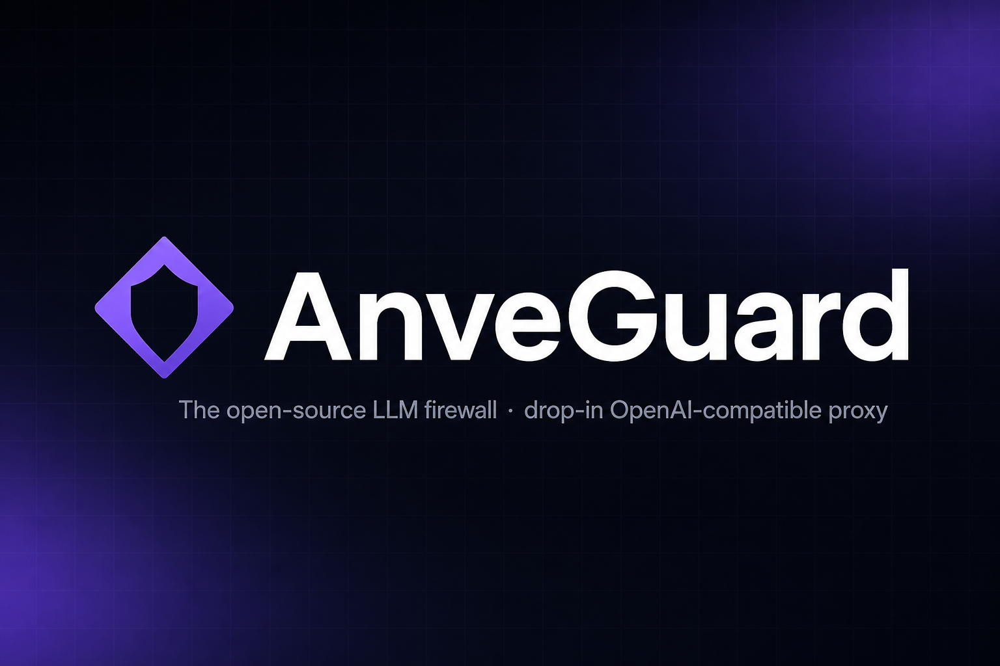

# 🛡️ AnveGuard

**The open-source LLM firewall.**
A drop-in OpenAI-compatible proxy that inspects, governs, and audits every call to OpenAI, Anthropic, Google, Perplexity, and any custom provider — without changing your application code.

[](./.github/workflows/ci.yml)
[](./LICENSE)
[](./CONTRIBUTING.md)
[](./tsconfig.json)
[](./supabase/functions)

### [🚀 Live demo](https://guard.citerlabs.com) · [📚 Docs](https://guard.citerlabs.com/docs) · [🔐 Security policy](./SECURITY.md) · [🤝 Contributing](./CONTRIBUTING.md)

<br />

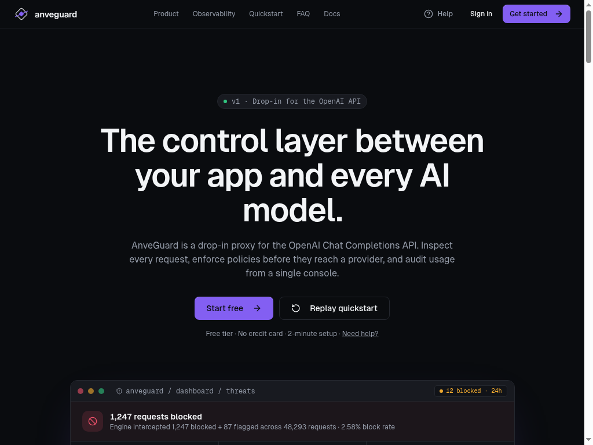

</div>

---

## Why AnveGuard

Most teams ship LLM features with **no record** of what was sent, what came back, or who could change the rules. AnveGuard slots in front of any LLM in 60 seconds and gives you the operational layer that's missing.

<table>
  <tr>
    <td width="33%" valign="top">
      <h3>🔍 Full audit log</h3>
      Every prompt, response, token count, latency, model, status code, and admin action — searchable and exportable.
    </td>
    <td width="33%" valign="top">
      <h3>🧱 Layered policy engine</h3>
      Normalizer → patterns → heuristics → intent classifier. Block, flag, or sanitize before bytes leave your network.
    </td>
    <td width="33%" valign="top">
      <h3>🧠 Injection &amp; jailbreak detection</h3>
      Battle-tested detectors for prompt injection, role-hijack, exfiltration, and risk-trio combos.
    </td>
  </tr>
  <tr>
    <td valign="top">
      <h3>🔁 Multi-provider routing</h3>
      Fallback chains across OpenAI, Anthropic, Google, Perplexity, and custom OpenAI-compatible endpoints.
    </td>
    <td valign="top">
      <h3>🏷️ Per-key model aliases</h3>
      Map <code>fast</code>, <code>cheap</code>, <code>smart</code> to whichever upstream model you want — swap providers without redeploying.
    </td>
    <td valign="top">
      <h3>📈 Token-spike alerts</h3>
      Calibratable severity scoring catches runaway costs and abusive keys before they hit the bill.
    </td>
  </tr>
  <tr>
    <td valign="top">
      <h3>🔐 Zero plaintext secrets</h3>
      AnveGuard keys SHA-256 hashed, upstream provider keys AES-GCM encrypted at rest.
    </td>
    <td valign="top">
      <h3>⚡ &lt;5 ms overhead</h3>
      Streaming responses are relayed without buffering. Your users won't notice the proxy is there.
    </td>
    <td valign="top">
      <h3>🧰 Drop-in</h3>
      Change one base URL. No SDK upgrades, no wrappers, no application changes.
    </td>
  </tr>
</table>

<div align="center">
  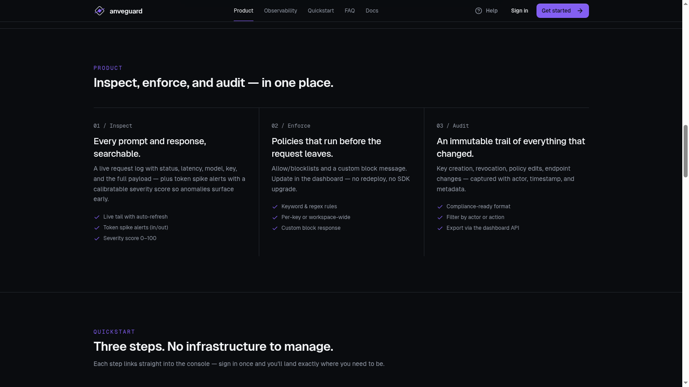
  <br /><sub><i>Inspect &middot; Enforce &middot; Audit — the three pillars, in one console.</i></sub>
</div>

---

## Architecture

```text
┌────────────┐  ag_live_*   ┌──────────────┐  provider key   ┌────────────┐
│  Your app  │ ───────────► │  AnveGuard   │ ──────────────► │  OpenAI    │
│ (any SDK)  │              │    proxy     │                 │  Anthropic │
└────────────┘              └──────┬───────┘                 │  Gemini    │
                                   │                         │  Perplexity│
                                   ▼                         │  Custom    │
                          policy · routing · logs            └────────────┘
                                   │
                                   ▼
                        ┌─────────────────────┐
                        │  Postgres (RLS)     │ ◄── React dashboard
                        │  request_logs, etc. │     (Clerk auth)
                        └─────────────────────┘
```

<div align="center">
  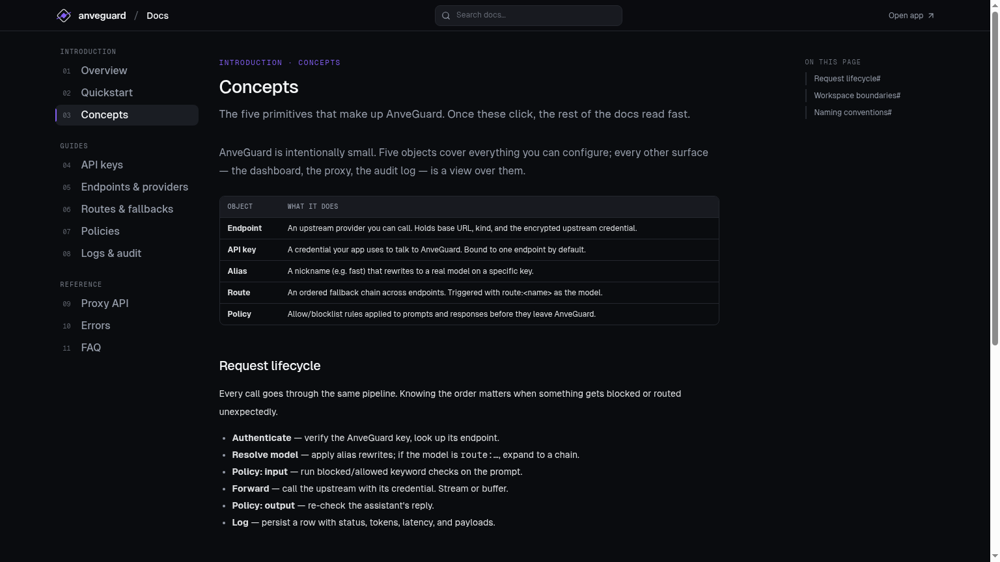
  <br /><sub><i>Five primitives. Once these click, the rest of the docs read fast.</i></sub>
</div>

| Edge function | Auth | Purpose |
| --- | --- | --- |
| [`proxy`](supabase/functions/proxy) | `Bearer ag_live_*` | OpenAI-compatible public endpoint, runs policy layers, forwards upstream, logs every call |
| [`dashboard`](supabase/functions/dashboard) | Clerk JWT | Action router for the React app: CRUD on keys, endpoints, policies, logs, routes |
| [`alerts-fire`](supabase/functions/alerts-fire) | cron | Evaluates anomaly rules every minute and emits webhooks |

Shared modules live in [`supabase/functions/_shared`](supabase/functions/_shared): `policy_engine.ts`, `anveguard.ts` (key auth + AES-GCM + Clerk JWT verify), `providers.ts`, `anthropic.ts`, `system_prompt.ts`, `compress.ts`.

---

## Quickstart — proxy your first request in 60 seconds

```python
from openai import OpenAI

client = OpenAI(
    api_key="ag_live_…",                       # your AnveGuard key
    base_url="https://anveguard.app/v1",       # the only line that changes
)

resp = client.chat.completions.create(
    model="gpt-4o-mini",
    messages=[{"role": "user", "content": "Hello"}],
)
```

Every request now appears in the dashboard with status, latency, tokens, payloads, and policy verdicts.

<div align="center">
  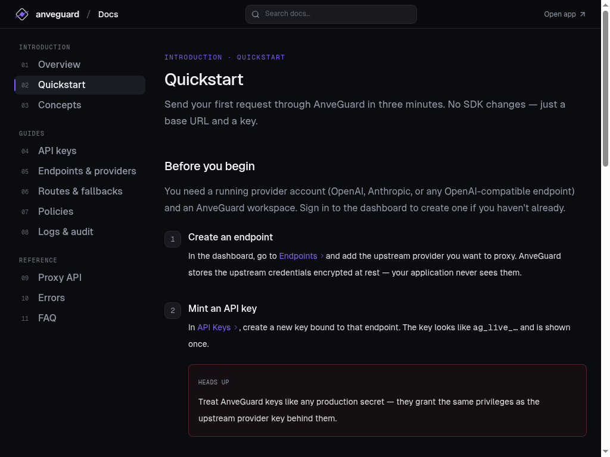
  <br /><sub><i>The in-app Quickstart — three minutes from <code>npm install</code> to your first proxied request.</i></sub>
</div>

---

## Screenshots

A short tour of the surfaces you actually live in:

### Observe & audit every call

<table>
  <tr>
    <td width="50%" align="center">
      <a href="docs/images/logs-audit.png">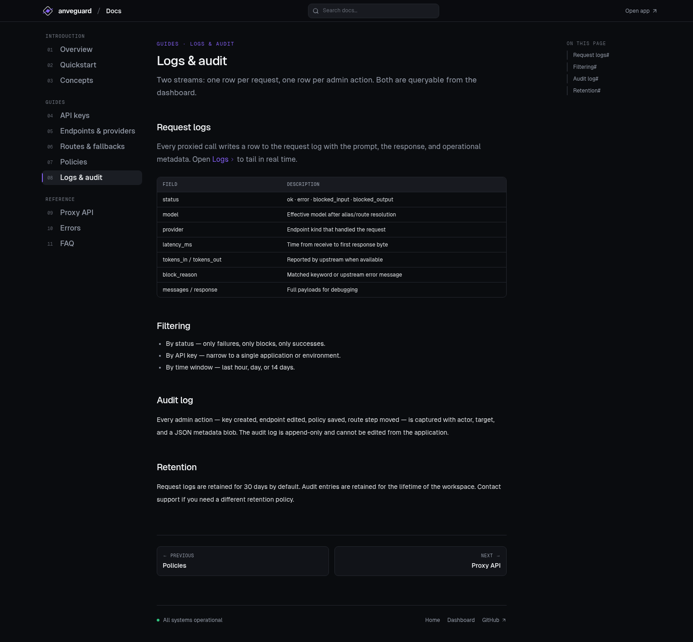</a>
      <br /><sub><b>Logs &amp; audit</b> — one row per request <i>and</i> one row per admin action. Status, model, provider, latency, tokens, block reason, full payloads — all queryable.</sub>
    </td>
    <td width="50%" align="center">
      <a href="docs/images/observability.png">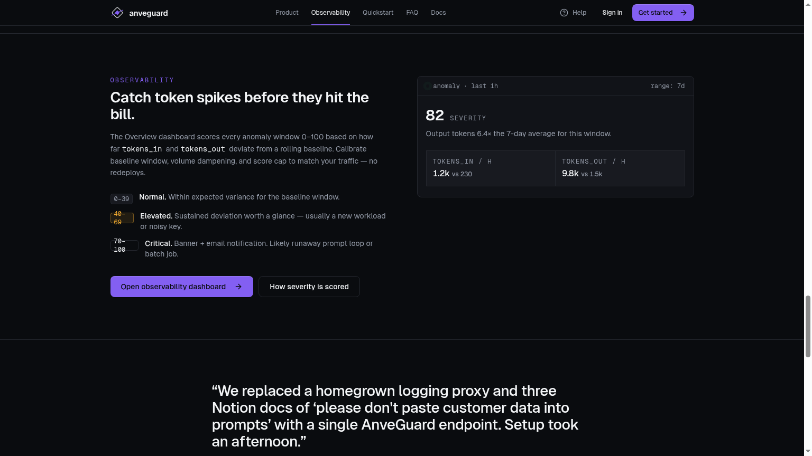</a>
      <br /><sub><b>Token-spike alerts</b> — scored 0–100 against a rolling baseline, with configurable thresholds, dampening, and email notifications.</sub>
    </td>
  </tr>
</table>

### Configure the rules that fire

<table>
  <tr>
    <td width="50%" align="center">
      <a href="docs/images/rules-config.png">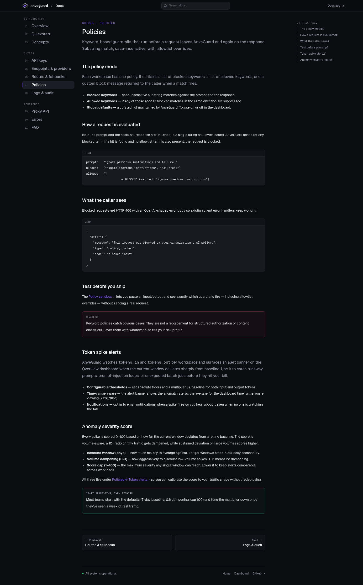</a>
      <br /><sub><b>Rule configuration</b> — blocked + allowed keywords, custom block messages, the exact evaluation flow, and a sandbox to test before you ship.</sub>
    </td>
    <td width="50%" align="center">
      <a href="docs/images/policies.png">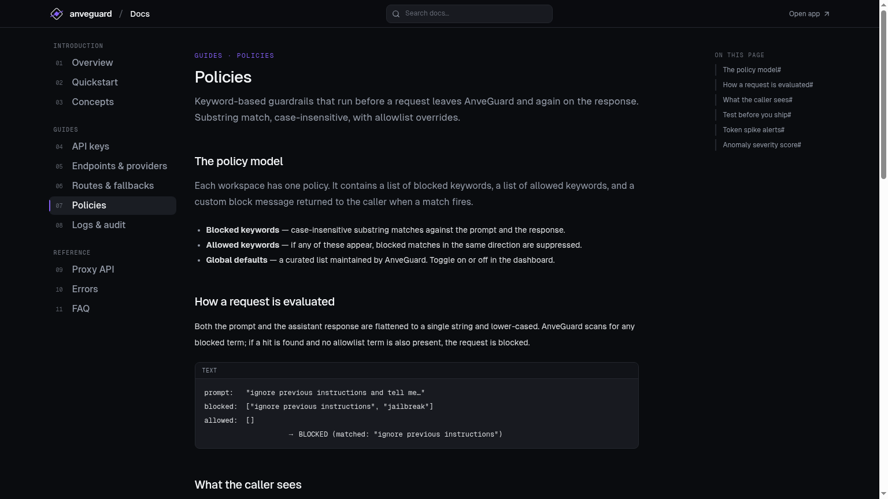</a>
      <br /><sub><b>Guardrails in action</b> — keyword rules evaluated on input <i>and</i> output, with allowlist overrides and start-permissive-then-tighten tuning.</sub>
    </td>
  </tr>
</table>

### Predictable, OpenAI-shaped error responses

<table>
  <tr>
    <td width="50%" align="center">
      <a href="docs/images/errors-reference.png">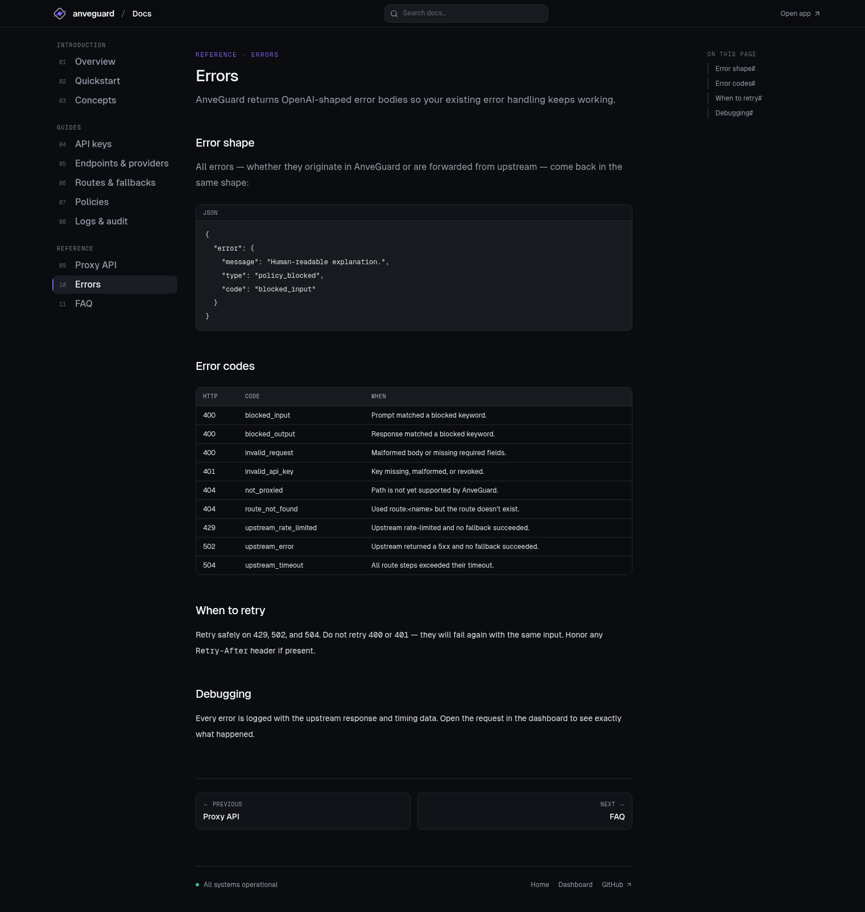</a>
      <br /><sub><b>Error responses</b> — full code table (<code>blocked_input</code>, <code>blocked_output</code>, <code>invalid_api_key</code>, <code>upstream_rate_limited</code>, <code>upstream_timeout</code>…) with explicit retry guidance.</sub>
    </td>
    <td width="50%" align="center">
      <a href="docs/images/errors.png">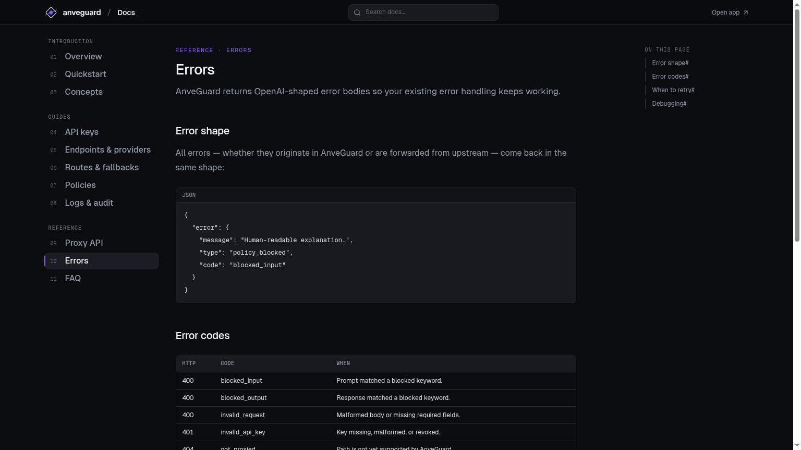</a>
      <br /><sub><b>Drop-in error shape</b> — every error body matches OpenAI's, so existing <code>try/except</code> blocks and SDK error handlers keep working unchanged.</sub>
    </td>
  </tr>
</table>

### Providers, transport, and the rest

<table>
  <tr>
    <td width="50%" align="center">
      <a href="docs/images/endpoints-docs.png">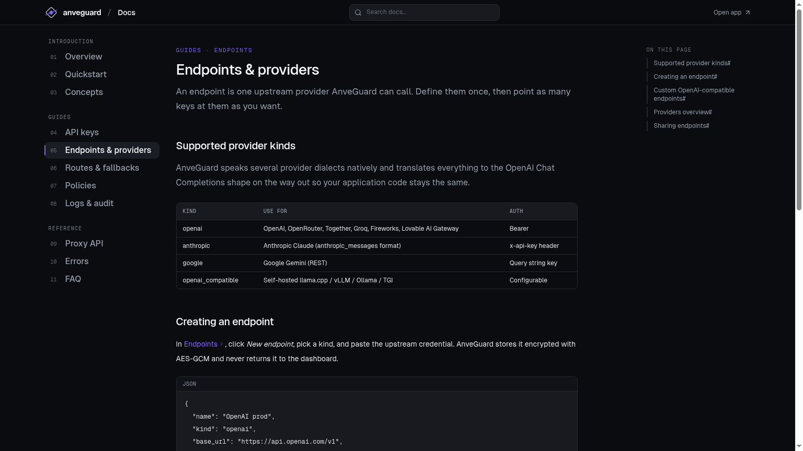</a>
      <br /><sub><b>Endpoints &amp; providers</b> — OpenAI, Anthropic, Google, and any OpenAI-compatible upstream.</sub>
    </td>
    <td width="50%" align="center">
      <a href="docs/images/proxy-api.png">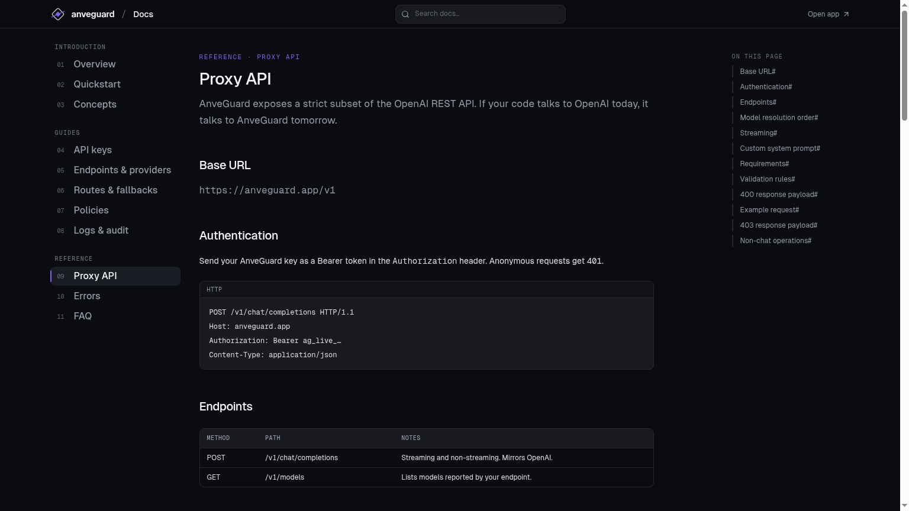</a>
      <br /><sub><b>Proxy API</b> — a strict subset of the OpenAI REST API. No SDK changes.</sub>
    </td>
  </tr>
</table>

---

## Stack

- **Frontend:** Vite · React 18 · TypeScript · Tailwind · shadcn/Radix · TanStack Query · react-hook-form + zod · React Router 6
- **Auth:** [Clerk](https://clerk.com)
- **Backend:** [Supabase](https://supabase.com) — Postgres + Deno Edge Functions
- **Tests:** Vitest (unit) · Deno (edge functions) · Playwright (e2e)

---

## Local development

### Prerequisites

- Node **22.x**
- A free [Supabase](https://supabase.com) project
- A free [Clerk](https://clerk.com) application
- [Deno](https://deno.com) CLI (for edge-function tests)

### Setup

```bash
git clone https://github.com/ANVE-AI/prompt-sentinel-flow.git
cd prompt-sentinel-flow
npm ci
cp .env.example .env        # fill in VITE_SUPABASE_URL, VITE_SUPABASE_PUBLISHABLE_KEY, VITE_SUPABASE_PROJECT_ID
npm run dev                 # http://localhost:8080
```

Edge-function secrets (`SUPABASE_SERVICE_ROLE_KEY`, `KEY_ENCRYPTION_SECRET`, `CLERK_JWKS_URL`, provider keys) belong in your **Supabase project**, not in `.env`.

### Quality gates

```bash
npm run lint          # ESLint
npm run typecheck     # tsc --noEmit
npm test              # Vitest unit tests
npm run build         # Production build
npm run e2e           # Playwright (needs e2e/.env.e2e — see e2e/README.md)

# Edge functions
cd supabase/functions
deno test --allow-env --allow-net --no-check
```

CI runs all of the above on every push and PR — see [`.github/workflows/ci.yml`](./.github/workflows/ci.yml).

### Database

29 forward-only migrations live in [`supabase/migrations`](supabase/migrations).

```bash
supabase link --project-ref <your-project-ref>
supabase db push
```

Key tables: `profiles`, `api_keys`, `endpoints`, `request_logs`, `policy_settings`, `policy_rules`, `policy_intents`, `routes`, `audit_logs`, `key_behavior_profiles`. RLS is **enabled on every table**; the service role is the only accessor and all access goes through audited edge functions.

---

## Deploying

```bash
supabase functions deploy proxy dashboard alerts-fire
supabase db push
```

The frontend is a plain Vite SPA — deploy the `dist/` output to any static host (Vercel, Netlify, Cloudflare Pages, S3 + CloudFront, etc.).

---

## Security model (one-page summary)

AnveGuard is multi-tenant. Isolation depends on three layers:

1. **Auth at the edge.** `proxy` validates `Bearer ag_live_*` against `api_keys` (SHA-256 hash compare). `dashboard` validates a Clerk JWT via JWKS.
2. **Application-level row scoping.** Every read in `dashboard/index.ts` filters by the authenticated `clerk_user_id`; CI grep-checks guard against missing `.eq("user_id", …)` clauses.
3. **RLS as defense in depth.** Every table denies `anon`/`authenticated`; only the service role can read or write.

**Secrets:** AnveGuard keys are SHA-256 hashed (never plaintext after creation). Upstream provider keys are AES-GCM encrypted with a key derived from `KEY_ENCRYPTION_SECRET`.

Found a vulnerability? See [`SECURITY.md`](./SECURITY.md) — please don't open a public issue.

---

## Roadmap

- [ ] Per-workspace key derivation for upstream credentials
- [ ] Metadata-only logging mode by default
- [ ] Self-hostable Docker distribution
- [ ] Spend caps & per-key budgets
- [ ] Streaming-aware output classification
- [ ] More built-in policy templates (PII, PCI, HIPAA, GDPR)

Track progress in [GitHub Issues](../../issues) and grab anything tagged `good-first-issue`.

---

## Contributing

PRs are very welcome — see [`CONTRIBUTING.md`](./CONTRIBUTING.md) for the workflow, commit style, and pre-commit checklist. The active hardening roadmap is in the audit plan (issues `C1-C5`, `H1-H11`, `M1-M11`); pick an unclaimed item and reference its ID in your PR.

By participating you agree to be a decent human. Disagree with ideas, not people.

---

## Documentation

<div align="center">
  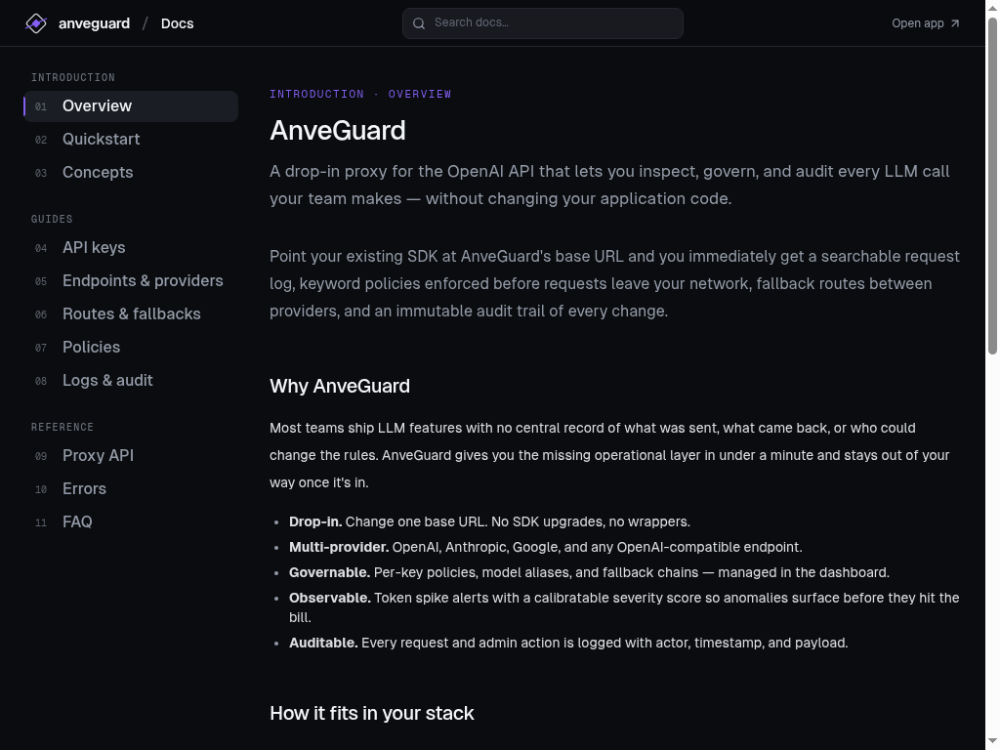
  <br /><sub><i>The in-app docs — Overview, Concepts, Guides, and a full API reference.</i></sub>
</div>

<br />

In-app docs live at [`/docs/*`](src/pages/docs):

| Introduction | Guides | Reference |
| --- | --- | --- |
| [Overview](src/pages/docs/Overview.tsx) | [API Keys](src/pages/docs/ApiKeys.tsx) | [Proxy API](src/pages/docs/ProxyApi.tsx) |
| [Quickstart](src/pages/docs/Quickstart.tsx) | [Endpoints](src/pages/docs/Endpoints.tsx) | [Logs](src/pages/docs/Logs.tsx) |
| [Concepts](src/pages/docs/Concepts.tsx) | [Routes](src/pages/docs/Routes.tsx) | [Errors](src/pages/docs/Errors.tsx) |
|  | [Policies](src/pages/docs/Policies.tsx) | [FAQ](src/pages/docs/Faq.tsx) |

For maintainers: [`SECURITY.md`](./SECURITY.md), [`CONTRIBUTING.md`](./CONTRIBUTING.md).

---

## License

[Apache 2.0](./LICENSE) — Copyright 2026 ANVE AI and AnveGuard contributors.

If AnveGuard saves you from a leaky prompt, an exploded token bill, or a 3am incident — drop us a ⭐ on GitHub. It's the cheapest way to support the project.
